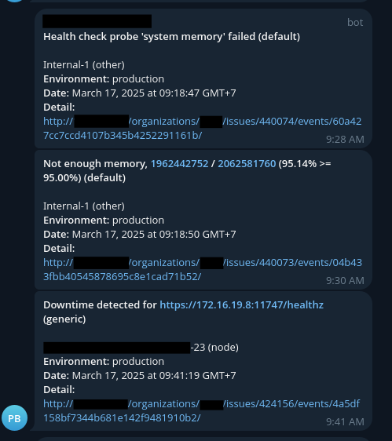

# Sentry Telegram Webhook

A rewrite of [tuanngocptn/sentry-telegram-webhook](https://github.com/tuanngocptn/sentry-telegram-webhook) which uses far less dependencies and far less logic.



## Installation

### Internal Integration Setup

You will need to create an Internal Integration on your Sentry instance: https://docs.sentry.io/organization/integrations/integration-platform/internal-integration/


The permission scope is really up to you, what in the screenshot is the minimum.


### Telegram Bot Setup

See here: https://core.telegram.org/bots/tutorial

1. Go to @BotFather
2. Create a new bot
3. Acquire the "bot token"
4. Invite the bot into your group (or specific group topic)
5. Acquire the "group ID" and the "topic ID" if you want one. See https://stackoverflow.com/questions/32423837/telegram-bot-how-to-get-a-group-chat-id


### Application setup

You are free to use any platform to deploy this. I provided a Dockerfile, but I won't provide a Docker image.

#### Build from source

> [!WARNING]
> Do not blindly execute this command. Read these instructions carefully.

```bash

git clone https://github.com/aldy505/sentry-telegram-webhook.git
cd sentry-telegram-webhook
# Assuming Node 20+ is available on your machine
npm ci

npm run build

cp .env.example .env
# Go fill that in first

npm run start # or `node ./dist/main.js` if you prefer
```

#### Docker

> [!WARNING]
> Do not blindly execute this command. Read these instructions carefully.

```bash
docker build -t sentry-telegram-webhook .

docker run -d \
  -p 6500:6500 \
  -e WEBHOOK_SECRET="foobar" \
  -e TELEGRAM_BOT_TOKEN="123456789:ABCdefGHIjklMNOPqrstUVWXYZ" \
  -e TELEGRAM_GROUP_ID="123456789" \
  -e TELEGRAM_TOPIC_ID="123456789" \
  sentry-telegram-webhook
```

#### Systemd

> [!WARNING]
> Do not blindly execute this command. Read these instructions carefully.

```bash
git clone https://github.com/aldy505/sentry-telegram-webhook.git

useradd -d /etc/sentry-telegram-webhook -s /bin/false -r -M sentry_webhook
mv sentry-telegram-webhook /etc/sentry-telegram-webhook
chown -R sentry_webhook:sentry_webhook /etc/sentry-telegram-webhook

cp sentry-telegram-webhook.service /etc/systemd/system/sentry-telegram-webhook.service
cp .env.example /etc/default/sentry-telegram-webhook
systemctl daemon-reload
systemctl enable sentry-telegram-webhook

# Edit /etc/default/sentry-telegram-webhook to your configuration
# Then run this:
systemctl start sentry-telegram-webhook
```

## License

```
MIT License

Copyright (c) 2025 Reinaldy Rafli <github@reinaldyrafli.com>

Permission is hereby granted, free of charge, to any person obtaining a copy
of this software and associated documentation files (the "Software"), to deal
in the Software without restriction, including without limitation the rights
to use, copy, modify, merge, publish, distribute, sublicense, and/or sell
copies of the Software, and to permit persons to whom the Software is
furnished to do so, subject to the following conditions:

The above copyright notice and this permission notice shall be included in all
copies or substantial portions of the Software.

THE SOFTWARE IS PROVIDED "AS IS", WITHOUT WARRANTY OF ANY KIND, EXPRESS OR
IMPLIED, INCLUDING BUT NOT LIMITED TO THE WARRANTIES OF MERCHANTABILITY,
FITNESS FOR A PARTICULAR PURPOSE AND NONINFRINGEMENT. IN NO EVENT SHALL THE
AUTHORS OR COPYRIGHT HOLDERS BE LIABLE FOR ANY CLAIM, DAMAGES OR OTHER
LIABILITY, WHETHER IN AN ACTION OF CONTRACT, TORT OR OTHERWISE, ARISING FROM,
OUT OF OR IN CONNECTION WITH THE SOFTWARE OR THE USE OR OTHER DEALINGS IN THE
SOFTWARE.
```

See [LICENSE](./LICENSE)